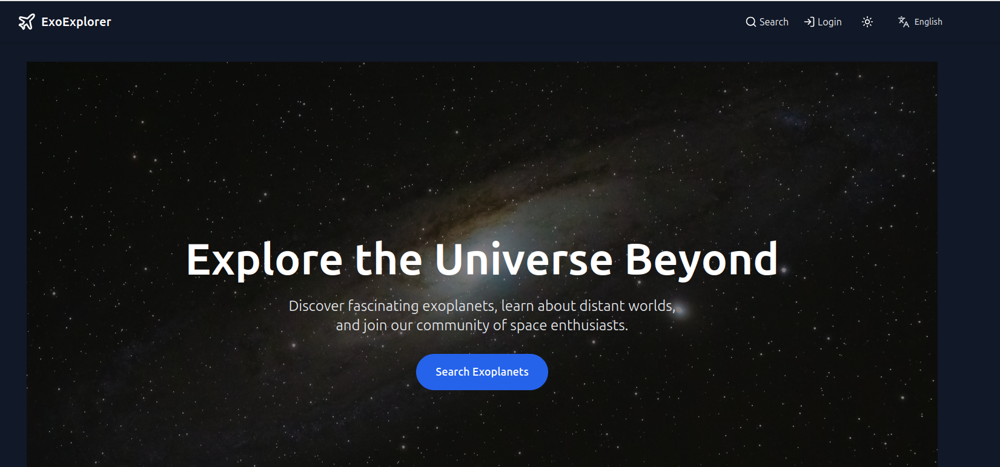
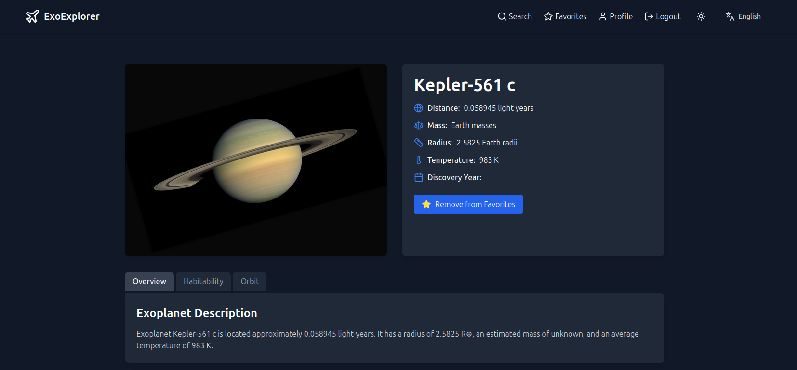
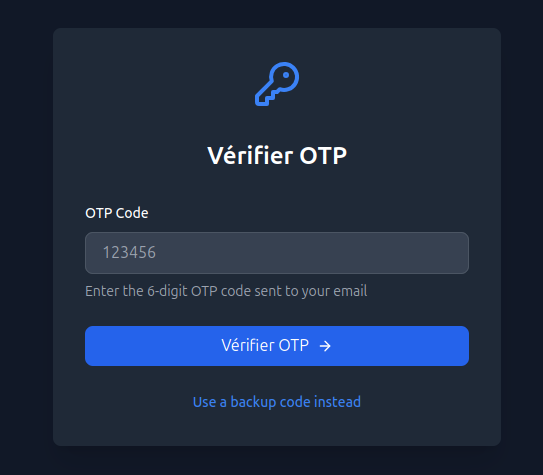
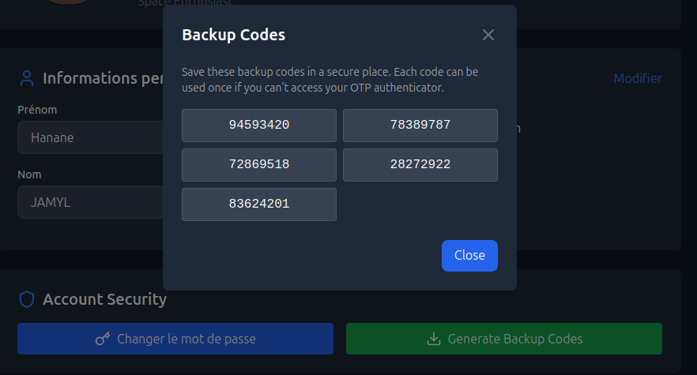
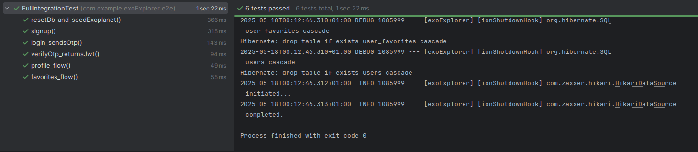
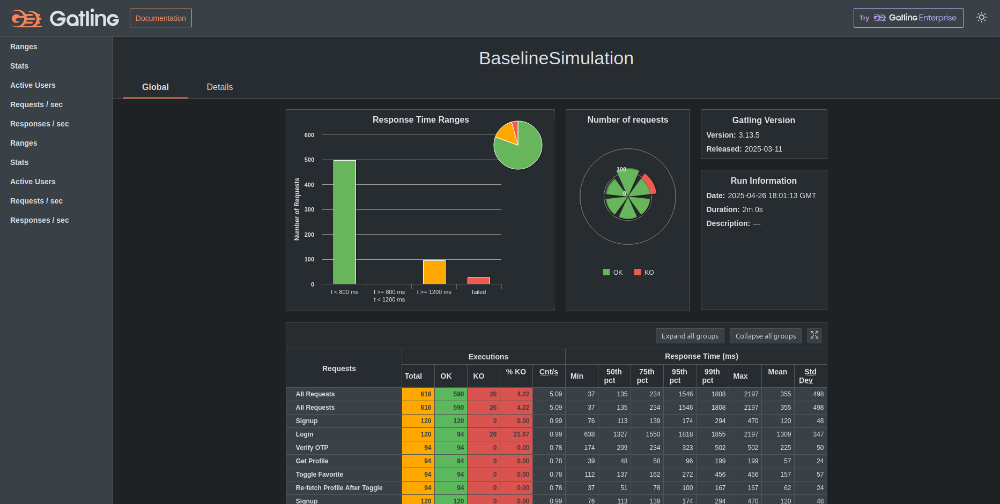

# ExoExplorer 🪐



ExoExplorer is a modern cloud-native application designed for exploring and discovering exoplanets. This platform enables users to browse exoplanet data, create favorites lists, compare exoplanets to Earth, and calculate theoretical travel times.

## Table of Contents
- [Project Overview](#project-overview)
- [Key Features](#key-features)
- [DevOps Infrastructure](#devops-infrastructure)
  - [CI/CD Pipeline](#cicd-pipeline)
  - [Containerization & Orchestration](#containerization--orchestration)
  - [Observability & Monitoring](#observability--monitoring)
  - [Infrastructure as Code](#infrastructure-as-code)
  - [Zero-Downtime Deployment](#zero-downtime-deployment)
- [Technology Stack](#technology-stack)
- [System Architecture](#system-architecture)
- [Design Patterns](#design-patterns)
- [Security Features](#security-features)
- [Good Practices](#good-practices)
- [Getting Started](#getting-started)
- [API Documentation](#api-documentation)
- [Testing](#testing)
- [Performance Testing](#performance-testing)
- [Multilingual Support](#multilingual-support)
- [Build System](#build-system)
- [Contributors](#contributors)

## Project Overview

ExoExplorer is a secure, responsive application for exoplanet enthusiasts and researchers. The platform retrieves and displays comprehensive information about exoplanets discovered across the universe. Users can:
- Browse exoplanet summaries and detailed information
- Add exoplanets to personal favorites lists
- Compare exoplanet characteristics to Earth
- Calculate theoretical travel times at different speeds
- View habitability assessments based on scientific criteria

The backend is built with a well-structured monolithic architecture using Spring Boot, featuring clean separation of concerns, robust security with JWT authentication, and two-factor authentication with email-based OTP verification.

## Key Features

### Comprehensive Exoplanet Data
- **Exoplanet Details**: Access information about each exoplanet's temperature, mass, radius, orbital period, and more
- **Habitability Assessment**: Determine if an exoplanet falls within the habitable zone based on scientific criteria
- **Earth Comparison**: Compare exoplanet characteristics to Earth for better understanding of scale


### Secure Authentication System
- **Two-Factor Authentication**: Enhanced security with email-based OTP verification
- **Backup Codes**: Recovery options with one-time backup codes
- **JWT Authentication**: Secure token-based authentication system

### User Features
- **Favorites Management**: Create personalized lists of favorite exoplanets
- **User Profiles**: Customize your experience with personalized settings
- **Dark/Light Mode**: Choose your preferred visual theme

### Administrative Capabilities
- **Data Management**: Admin users can refresh, clear, or add test exoplanet data
- **User Management**: Administrators can manage user accounts and permissions

## DevOps Infrastructure

ExoExplorer leverages modern DevOps practices to ensure reliability, scalability, and maintainability. Our infrastructure is designed to be fully reproducible, resilient, and independent of network constraints.

### CI/CD Pipeline


Our comprehensive CI/CD pipeline automates the entire software delivery process:

- **Continuous Integration**: Automated build and test on each commit
- **Continuous Deployment**: Automated deployment to Kubernetes environment
- **GitHub Webhooks**: Trigger builds automatically on code changes
- **Docker Hub Integration**: Seamless container publication
- **Quality Gates**: Ensuring code quality before deployment

```yaml
// Example stage from our Jenkinsfile
stage('Build & Test') {
  steps {
    sh 'npm install && npm run test'
    sh 'mvn clean package'
  }
}
```

### Containerization & Orchestration


**Figure — Pods successfully deployed across all namespaces**  
This screenshot shows all running pods across namespaces, including:
* 🟢 `exoexplorer` → Backend and frontend microservices (Spring Boot & React)
* 🟢 `observability` → Grafana, Prometheus, Alertmanager, Mailhog
* 🟢 `ingress` → NGINX Ingress Controller for HTTP routing
* 🟢 `kube-system` → MicroK8s core system pods

ExoExplorer leverages containerization and orchestration for environment consistency and scalability:

- **Docker**: Lightweight, portable containers for both frontend and backend
- **MicroK8s**: Production-grade Kubernetes distribution for container orchestration
- **Namespaces**: Isolated environment for ExoExplorer components
- **Ingress Controller**: Intelligent HTTP routing with TLS termination
- **Horizontal Pod Autoscaling**: Automatic scaling based on resource utilization
- **Resource Limits**: Guaranteed resource allocation and constraint enforcement
- **Replicated Deployments**: Multiple pods per service for high availability

### Observability & Monitoring


Comprehensive monitoring stack for real-time application health insights:

- **Prometheus**: Metrics collection with PromQL for advanced querying
- **Grafana**: Beautiful, customizable dashboards with preset templates
- **Alert Manager**: Proactive notification system for system anomalies
- **Spring Actuator**: Endpoint health, metrics, and information exposition
- **JVM Monitoring**: Heap, garbage collection, and thread monitoring
- **Custom Dashboards**: Purpose-built visualizations for different stakeholders

### Infrastructure as Code

Our entire infrastructure is defined as code, ensuring reproducibility and consistency:

- **Kubernetes Manifests**: Declarative definition of all infrastructure components
- **Jenkinsfile**: Pipeline definition as code
- **Docker Compose**: Development environment parity
- **Helm Charts**: Templated application deployment
- **Host Configuration**: Automated host setup scripts

### Zero-Downtime Deployment

ExoExplorer implements zero-downtime deployment strategies:

- **Rolling Updates**: Gradual replacement of pods for seamless transitions
- **Health Probes**: Liveness and readiness checks ensure only healthy instances receive traffic
- **Blue/Green Capability**: Infrastructure supports advanced deployment patterns
- **Stateless Design**: Application designed for horizontal scaling
- **Database Migration Strategy**: Backward-compatible schema changes

## Technology Stack

### Backend
- **Framework**: Spring Boot 3.3.9
- **Language**: Java 21
- **Database**: Oracle Database (but configurable for any relational DB)
- **Security**: Spring Security, JWT, BCrypt password hashing
- **Build Tool**: Maven
- **ORM**: Spring Data JPA with Hibernate
- **Caching**: Spring Cache with ConcurrentMapCacheManager

### DevOps & Infrastructure
- **Container Runtime**: Docker
- **Orchestration**: Kubernetes (MicroK8s)
- **CI/CD**: Jenkins
- **Monitoring**: Prometheus, Grafana
- **Version Control**: Git, GitHub
- **Database**: Oracle Autonomous Database on OCI
- **Log Management**: ELK Stack (Elasticsearch, Logstash, Kibana)

### Frontend
- **Framework**: React with Vite
- **Styling**: TailwindCSS
- **State Management**: Redux
- **UI Components**: Custom component library

### Testing
- **Unit Testing**: JUnit 5, Mockito
- **Integration Testing**: Spring Boot Test
- **Performance Testing**: Gatling
- **Load Testing**: Apache JMeter

## System Architecture

### Application Architecture

Our application follows a layered architecture with clean separation of concerns:

1. **Presentation Layer**: RESTful API controllers that handle HTTP requests and responses
2. **Service Layer**: Contains business logic and orchestrates operations
3. **Repository Layer**: Provides data access abstraction to the database 
4. **Domain Layer**: Contains entity classes representing the business domain
5. **External Integration**: Services for connecting to external APIs for exoplanet data

### Infrastructure Architecture


Our cloud-native infrastructure features:

1. **Frontend Tier**: Stateless React containers served via Nginx
2. **API Tier**: Scalable Spring Boot services with auto-scaling
3. **Database Tier**: Oracle Autonomous Database for persistent storage
4. **Monitoring Stack**: Prometheus and Grafana for metrics and visualization
5. **CI/CD Pipeline**: Jenkins for automated build and deployment

### Security Architecture

The application implements a layered security approach:
- HTTP request filtering with Spring Security
- JWT token-based authentication
- Role-based access control for protected endpoints
- Two-factor authentication with OTP via email

## Design Patterns

ExoExplorer implements several design patterns to ensure code maintainability, flexibility, and adherence to best practices:

### Structural Patterns
- **Decorator Pattern**: Used in `ExoplanetDecorator` to dynamically add features like habitability assessment and Earth comparisons to exoplanet data
- **Proxy Pattern**: Implemented as a Virtual Proxy (Lazy Loading) where exoplanet summaries are displayed in lists with minimal data, while detailed information is loaded only when explicitly requested through the details endpoint

### Creational Patterns
- **Builder Pattern**: `ExoplanetBuilder` enables flexible construction of exoplanet objects
- **Factory Pattern**: `UserFactory` and `OtpStrategyFactory` create objects without exposing implementation details

### Behavioral Patterns
- **Observer Pattern**: Used for event handling (e.g., `UserActionSubject` notifying observers of user actions)
- **Strategy Pattern**: `OtpVerificationStrategy` provides different verification strategies (standard OTP vs. backup codes)

### Architectural Patterns
- **MVC Pattern**: Controllers, services, and views are cleanly separated
- **Repository Pattern**: Data access is abstracted through repository interfaces
- **Microservices Pattern**: Frontend and backend deployed as separate services

## Security Features

### Multi-layered Authentication
1. **Password + OTP**: Two-factor authentication using email-based OTP


2. **Backup Codes**: Additional recovery option for account access


3. **JWT Authentication**: Secure, stateless authentication with role-based access control

### Data Protection
- **Password Hashing**: BCrypt for secure password storage
- **API Security**: Secured endpoints with role-based access control
- **CORS Configuration**: Configured to prevent cross-origin attacks
- **Input Validation**: Request validation using Jakarta Validation API

### Configuration Security
- **Jasypt Encryption**: Sensitive properties are encrypted in configuration files
- **Environment Variables**: Critical secrets stored as environment variables
- **Kubernetes Secrets**: Sensitive information managed by Kubernetes secrets

## Good Practices

### SOLID Principles
- **Single Responsibility**: Each class has one reason to change (e.g., controllers handle requests, services handle business logic)
- **Open/Closed**: New functionality is added through extension, not modification (e.g., exoplanet decorators)
- **Liskov Substitution**: Proper inheritance hierarchies (e.g., verification strategies)
- **Interface Segregation**: Focused interfaces (e.g., `OtpVerificationStrategy`)
- **Dependency Inversion**: High-level modules depend on abstractions (e.g., repositories, services)

### Clean Code
- **Meaningful Names**: Clear, descriptive naming conventions
- **Small Functions**: Functions designed to do one thing well
- **DRY Principle**: Avoiding code duplication through abstraction
- **Comments and Documentation**: Comprehensive Javadoc for public APIs

### Testing Practices
- **Test Coverage**: Extensive unit and integration tests
- **Test Isolation**: Tests are independent and reproducible
- **Mock Objects**: Using Mockito to test components in isolation

## Getting Started

### Prerequisites
- Java 21 or higher
- Maven 3.8+
- Docker and Kubernetes
- kubectl and MicroK8s (for Kubernetes deployment)
- Oracle Database or another relational database
- SMTP server for email functionality

### Installation

#### Local Development Environment

1. Clone the repository:
```bash
git clone https://github.com/m-elhamlaoui/development-platform-novasphere.git
cd exoExplorer
```

2. Configure database connection in `application.properties`:
```properties
spring.datasource.url=jdbc:oracle:thin:@yourdbconnection
spring.datasource.username=your_username
spring.datasource.password=your_password
```

3. Configure email settings in `application.properties`:
```properties
spring.mail.host=your-smtp-server
spring.mail.port=587
spring.mail.username=your-email
spring.mail.password=your-password
spring.mail.properties.mail.smtp.auth=true
spring.mail.properties.mail.smtp.starttls.enable=true
```

4. Build the project:
```bash
mvn clean install
```

5. Run the application:
```bash
mvn spring-boot:run
```

The application will be available at `http://localhost:8081`.

#### Kubernetes Deployment

1. Set up your Kubernetes environment:
```bash
# Install and configure MicroK8s
sudo snap install microk8s --channel=1.30/stable --classic
sudo usermod -aG microk8s $USER
microk8s status --wait-ready
microk8s enable dns storage ingress
microk8s enable prometheus grafana   # for observability
```

2. Apply Kubernetes manifests:
```bash
kubectl apply -f kubernetes/namespace.yaml
kubectl apply -f kubernetes/
```

3. Configure local DNS (optional, for development):
```bash
sudo tee -a /etc/hosts >/dev/null <<'EOF'
127.0.0.1   exoexplorer.local
127.0.0.1   api.exoexplorer.local
127.0.0.1   grafana.exoexplorer.local
127.0.0.1   prometheus.exoexplorer.local
EOF
```

4. Access the application:
- Frontend: `http://exoexplorer.local`
- API: `http://api.exoexplorer.local`
- Grafana: `http://grafana.exoexplorer.local`
- Prometheus: `http://prometheus.exoexplorer.local`

### Setting up CI/CD Pipeline

1. Install Jenkins:
```bash
wget -q -O - https://pkg.jenkins.io/debian-stable/jenkins.io-2023.key | \
  sudo tee /usr/share/keyrings/jenkins-keyring.asc >/dev/null
echo deb [signed-by=/usr/share/keyrings/jenkins-keyring.asc] \
  https://pkg.jenkins.io/debian-stable binary/ | \
  sudo tee /etc/apt/sources.list.d/jenkins.list >/dev/null
sudo apt update
sudo apt install -y openjdk-17-jdk jenkins git
```

2. Configure Jenkins with required plugins:
- Docker
- Docker Pipeline
- Kubernetes CLI
- Credentials Binding
- Blue Ocean (optional, for better UI)

3. Create Docker Hub credentials in Jenkins:
- Add credentials with ID: `docker-hub-credentials`

4. Create a new Pipeline job pointing to your repository

5. Ensure your repository contains the `Jenkinsfile` for pipeline definition

## API Documentation

### Authentication Endpoints
- `POST /api/auth/signup` - Register a new user
- `POST /api/auth/login` - Login and receive OTP
- `POST /api/auth/verify-otp` - Verify OTP and get JWT token
- `POST /api/auth/generate-backup-codes` - Generate backup codes
- `POST /api/auth/verify-backup-code` - Verify a backup code

### Exoplanet Endpoints
- `GET /api/exoplanets` - Get all exoplanets
- `GET /api/exoplanets/summary` - Get paginated exoplanet summaries (with optional filters)
- `GET /api/exoplanets/{id}` - Get exoplanet by ID
- `GET /api/exoplanets/{id}/details` - Get detailed exoplanet information with decorators
- `GET /api/exoplanets/habitable` - Get potentially habitable exoplanets
- `POST /api/exoplanets/refresh` - Refresh exoplanet data from external API (admin only)

### User Endpoints
- `GET /api/user/profile` - Get user profile information
- `PUT /api/user/update-profile` - Update user profile
- `POST /api/user/change-password` - Change user password
- `GET /api/user/favorites` - Get user's favorite exoplanets
- `POST /api/user/toggle-favorite` - Add/remove an exoplanet from favorites
- `PUT /api/user/preferences` - Update user preferences (theme, language)

### Admin Endpoints
- `POST /api/admin/data-loader/insert-500-exoplanets` - Insert test exoplanets
- `DELETE /api/admin/data-loader/clear-exoplanets` - Clear all exoplanet data
- `POST /api/admin/data-loader/insert-habitable-exoplanets` - Insert habitable exoplanet samples

## Testing

ExoExplorer includes extensive testing at multiple levels:

### Unit Tests
Unit tests focus on individual components like services, repositories, and controllers. Test classes are located in the `src/test/java` directory.

### Integration Tests
Integration tests verify interactions between components. Examples include:
- `AuthIntegrationTest` - Testing authentication flow
- `ExoplanetIntegrationTest` - Testing exoplanet data retrieval
- `UserIntegrationTest` - Testing user operations

### E2E Tests
End-to-end tests check complete user journeys through the system:
- `FullIntegrationTest` - Testing the full signup, login, and favorites flow

- `SecurityIntegrationTest` - Testing security configurations

### Running Tests
Run all tests with:
```bash
mvn test
```

Run specific test classes with:
```bash
mvn test -Dtest=ExoplanetServiceTest
```

## Performance Testing

Performance testing is conducted using Gatling to ensure the application can handle expected loads:

### Test Scenarios
- `SmokeSimulation` - Basic functionality verification
- `BaselineSimulation` - Performance baseline with light load
- `LoadSimulation` - Normal expected load
- `StressSimulation` - Heavy load to find breaking points
- `SpikeSimulation` - Sudden traffic spikes
- `SoakSimulation` - Extended duration testing

### Running Performance Tests
To run performance tests:
```bash
./run-performance-tests.sh
```

This script:
1. Starts the application with the performance profile
2. Generates test data
3. Runs the selected Gatling simulation
4. Displays results

### Performance Monitoring
During tests, performance is monitored with:
- Response time metrics
- Success rate percentages
- Resource utilization (CPU, memory)
- Database connection metrics


## Multilingual Support

ExoExplorer implements multilingual support to serve a global audience:

### Implementation
- Frontend uses React's i18n for translation keys
- User language preference stored in user profile
- Support for English and French languages
- Language can be changed from user preferences

### Adding Languages
To add a new language:
1. Create a new translation file in the frontend
2. Add language option in user preferences
3. Update language detection logic

## Build System

ExoExplorer uses Maven for build automation and dependency management:

### Maven Structure

We utilize a maven project structure that allows us to:
- Manage dependencies efficiently
- Follow a consistent build lifecycle
- Run tests as part of the build process
- Package the application into a deployable JAR

### Key Maven Configuration Features

- **Properties Management**: Centralized version management for dependencies
- **Dependency Management**: Clear organization of project dependencies
- **Plugin Configuration**: Build, test, and packaging plugins configured for the project
- **Profiles**: Different profiles for various environments (dev, test, prod)

### GitHub Integration

Our development workflow leverages GitHub for:
- Source code version control
- Issue tracking for bugs and features
- Code reviews via pull requests
- Release management

## DevOps Infrastructure Details

### Complete Deployment Process

1. Developer pushes code to GitHub repository
2. GitHub webhook triggers Jenkins build
3. Jenkins pipeline executes:
   - Checkout code
   - Install dependencies
   - Run tests
   - Build Docker images
   - Push images to Docker Hub
   - Update Kubernetes deployments
4. Kubernetes controller applies rolling update
5. New version becomes available without downtime
6. Prometheus captures deployment metrics
7. Grafana visualizes deployment success

### Monitoring Stack Components

- **Prometheus Server**: Collects and stores time-series metrics
- **AlertManager**: Routes alerts to appropriate channels
- **Grafana**: Visualizes metrics with dashboards
- **Node Exporter**: Collects host-level metrics
- **cAdvisor**: Collects container metrics
- **Spring Boot Actuator**: Exposes application metrics

### Kubernetes Resources

The application is deployed using the following Kubernetes resources:

- **Deployments**: Manage application replicas
- **Services**: Expose applications internally and externally
- **Ingress**: Route traffic to services
- **ConfigMaps**: Store configuration data
- **Secrets**: Store sensitive information
- **HorizontalPodAutoscalers**: Automatically scale based on metrics

## Contributing

We welcome contributions to ExoExplorer! Please see our [CONTRIBUTING.md](CONTRIBUTING.md) for details.

## License

This project is licensed under the MIT License - see the [LICENSE.md](LICENSE.md) file for details.